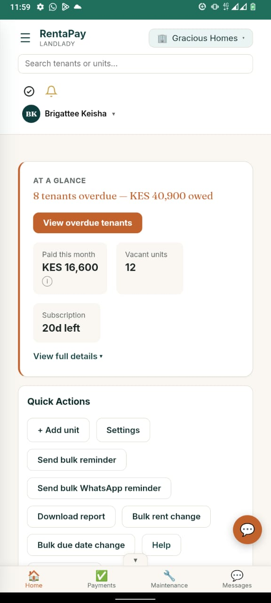
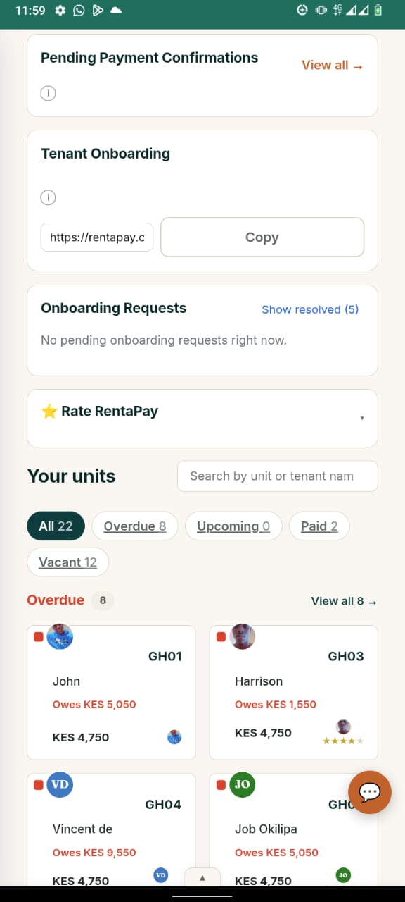
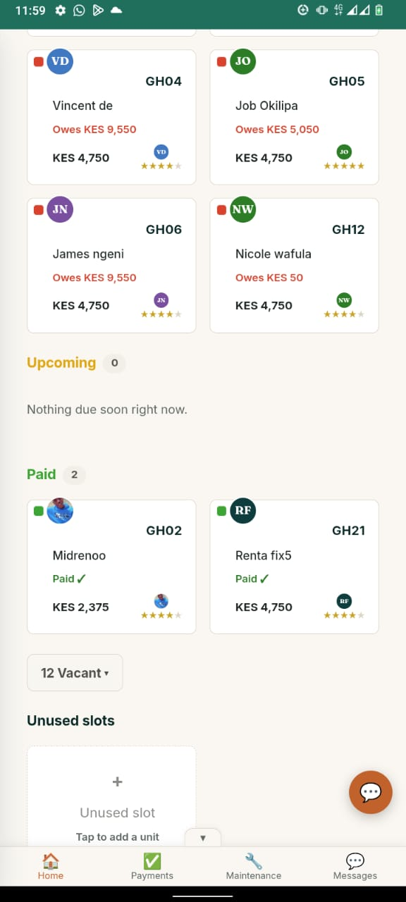
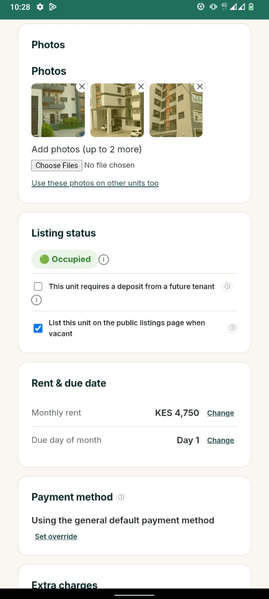
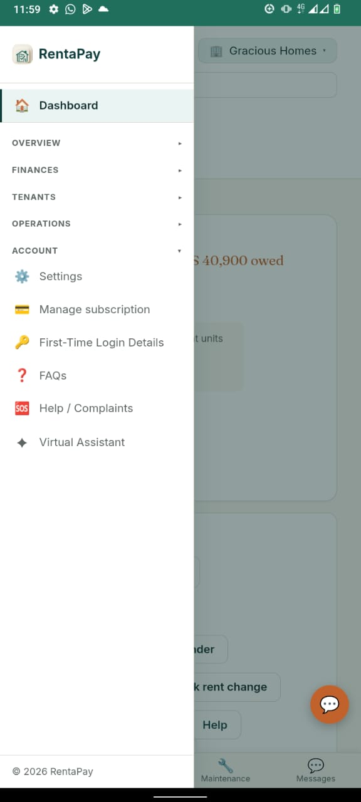

# The Landlord portal

*Real product screenshot. Landlord and tenant names, and amounts shown, are illustrative.*

From the landlord dashboard you can see, at a glance:

- **Tenants overdue and the total owed**, front and center, with a one tap way to
  view them.
- **What has been paid this month**, how many units are vacant, and how many days
  are left on your subscription.
- **Quick actions**: add a unit, send a bulk rent or WhatsApp reminder, download a
  report, or change rent and due dates across units at once.

*Real product screenshot. Tenant names and amounts shown are illustrative.*

Below the summary, every unit shows its tenant, what they owe, and their status,
filterable to All, Overdue, Upcoming, Paid, or Vacant, so you can go straight to
the tenants who need attention.

*Real product screenshot. Tenant names and amounts shown are illustrative.*

Paid tenants are shown just as clearly as overdue ones, along with a count of
vacant units and any unused slots on your subscription, ready to assign to a new
tenant.

*Real product screenshot.*

Each unit has its own settings: photos, whether it is occupied or listed publicly
when vacant, monthly rent and due date, security deposit requirements, and payment
method, so unit level details stay accurate as tenants move in and out. A unit's
photos scroll through the same smooth, focus based photo strip used throughout the
app, whether you are viewing them here or a visitor is viewing them on the public
listing page.

*Real product screenshots.*

The full menu gives you everything in one place: overview, finances (statistics,
payment history, disputed charges, payment plan requests, pending confirmations),
tenants, day to day operations, and account settings including subscription
management, an annual report, and a data export of your own records.

You can add properties and units as your portfolio grows, and invite a property
manager, caretaker, or general manager to a specific property without giving them
access to your other properties.

## Property managers, caretakers, and general managers

Everyone you invite logs into the same landlord portal shown above. There is no
separate app or layout for them. What changes is what they are allowed to see and
do, scoped to the property or properties you have given them access to.

**Property managers** can do almost everything a landlord can on their assigned
properties: record and review payments, manage tenants, and handle day to day
operations. They cannot add or remove other property managers, touch billing or
subscription payment, or view, set up, or change automatic rent collection - that
stays locked to the landlord's own login and is password-protected even for the
landlord, since it holds the account's own Daraja/banking credentials.

**General managers** sit above property managers in trust and scope, typically
running the operational side of your business across some or all of your
properties. A general manager protects sensitive actions behind their own personal
Operations PIN, separate from their login password, which they are asked for again
before completing certain high impact actions. You can review a general manager's
activity through an activity log, and, for a defined set of actions, revert what
they have done within a limited window afterward.

**Caretakers** have a lighter weight version of the same portal, meant for someone
on the ground rather than someone handling the books. A caretaker can view their
assigned properties and tenants, send reminders, submit utility meter readings, and
revoke a vacating notice, but cannot:

- Record, confirm, or reject a rent payment
- View payment history, financial statistics, or disputed charges
- Access payment plan requests
- Add, remove, or edit units, or change rent amounts
- Add extra charges, upload documents, or log expenses
- Remove a tenant, edit a tenant's balance, settle a security deposit, or transfer
  a tenant between units
- View the list of other property managers
- Edit payment method details
- View, set up, or change automatic rent collection

If a caretaker tries to do any of these, they are shown a message pointing them to
the landlord or property manager instead.

## Security deposits, at a glance

When you onboard a tenant, you can record whether they paid a security deposit,
and how much. That amount is tracked completely separately from rent; it is never
added to a tenant's balance and never drawn against automatically. When a tenancy
ends, you record what happened to the deposit: refunded in full, partially
refunded with a reason for anything withheld, or forfeited. See the dedicated
Security Deposits section of this guide for the full picture.

## Utility submetering, at a glance

Where a property has a shared or individual water or electricity meter, you can
set it up, submit monthly readings, and let RentaPay calculate each unit's share
of the bill based on occupied days, with the ability to review and override before
finalising and sending it. See the dedicated Utility Submetering section of this
guide for the full picture.

## The bottom navigation bar

On a phone, the landlord/manager/caretaker portal shows Home, Payments,
Maintenance, and Messages fixed to the bottom of the screen at all times, so any
core area is one tap away no matter which screen you're on. This bar is designed to
never cover the last item in a list or the last button on a screen - every
scrollable screen leaves enough room below its last item specifically so the bar
never sits on top of real content.

## Quick Actions

The Home screen's Quick Actions grid puts the most frequent landlord tasks - adding
a unit, sending a bulk reminder, downloading a report, changing rent or due dates
across multiple units at once, and reaching Help - within a single tap from the
dashboard, without needing to navigate into a specific unit or tenant first.

## Overdue tenants at a glance

The "At a glance" card on the Home screen surfaces the number of tenants currently
overdue and the total amount owed across them, with a direct link into the filtered
list of exactly those tenants, so the most time-sensitive information doesn't
require any digging to find.

## Payments tab in detail

The Payments tab shows every payment recorded across your properties, filterable by
unit, tenant, or date range, with each entry showing its amount, the M-Pesa
transaction code where applicable, whether it was confirmed automatically or
manually, and who confirmed it if manual. From here you can also record a manual
payment on a tenant's behalf, issue a receipt, or drill into a specific payment's
full detail, including any dispute raised against it.

## Maintenance tab in detail

The Maintenance tab lists every maintenance request across your units, each showing
its current status (such as reported, in progress, or resolved), when it was
reported, and the tenant who reported it. Updating a request's status here is what
the tenant sees reflected on their own side - there's no separate step needed to
"notify" them of a status change, since the same record is what both sides are
looking at.

## Settings and account management

The Settings area covers account-level details: your own contact information,
notification preferences, and, for a landlord, adding or removing managers and
caretakers and setting what each one can access. Subscription and billing details
are also managed from here, including viewing your current billing period, unit
count, and renewing or changing your billing period length.

## Automatic rent collection, at a glance

This is also where a landlord turns on automatic rent collection: connect your own
Safaricom Business Paybill or Till, and rent stops being something you have to
review at all. A tenant taps "Pay Rent," a real M-Pesa prompt lands on their phone,
and the moment they enter their PIN, Safaricom confirms it straight back to
RentaPay - their balance updates itself and you're notified, with nobody checking a
transaction code by hand. Set it up once and it keeps running for the life of your
account; there's no per-payment step to repeat.

Setup itself is a handful of guided steps in Settings: confirm you have (or apply
for) a Business Paybill or Till, enter your Paybill/Till number and Daraja app
credentials, and RentaPay sends a small real test push to your own phone to verify
everything automatically - no waiting on RentaPay staff to review anything. If
you're mid-application with Safaricom, your progress is saved, so you can pick up
right where you left off once your Paybill is ready.

It's entirely optional and reversible: manual confirmation remains available to
every landlord regardless, and you can switch back to it at any time without losing
any payment history. See "Automatic rent collection" and "How payments flow"
earlier in this guide for the full detail, including which Paybill/Till types
qualify.
