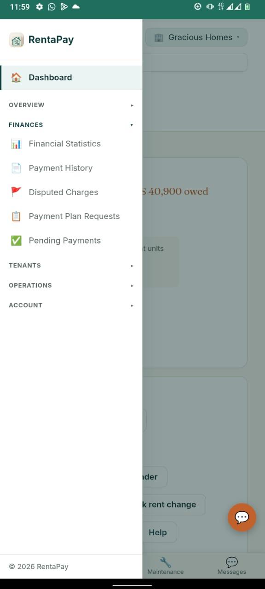

# The Landlord portal

*Real product screenshot — landlord and tenant names, and amounts shown, are illustrative.*

From the landlord dashboard you can see, at a glance:

- **Tenants overdue and the total owed**, front and center, with a
  one-tap way to view them.
- **What's been paid this month**, how many units are vacant, and how
  many days are left on your subscription.
- **Quick actions** — add a unit, send a bulk rent or WhatsApp reminder,
  download a report, or change rent/due dates across units at once.

*Real product screenshot — tenant names and amounts shown are illustrative.*

Below the summary, every unit shows its tenant, what they owe, and their
status — filterable to **All**, **Overdue**, **Upcoming**, **Paid**, or
**Vacant**, so you can go straight to the tenants who need attention.

*Real product screenshot — tenant names and amounts shown are illustrative.*

Paid tenants are shown just as clearly as overdue ones, along with a
count of vacant units and any unused slots on your subscription, ready
to assign to a new tenant.

*Real product screenshot.*

Each unit has its own settings — photos, whether it's occupied or listed
publicly when vacant, monthly rent and due date, deposit requirements,
and payment method — so unit-level details stay accurate as tenants move
in and out.

*Real product screenshots.*

The full menu gives you everything in one place: overview, finances
(statistics, payment history, disputed charges, payment plan requests,
pending confirmations), tenants, day-to-day operations, and account
settings including subscription management.

You can add properties and units as your portfolio grows, and invite a
property manager or caretaker to a specific property without giving them
access to your other properties.

## Property managers and caretakers

Managers and caretakers you invite log into the **same landlord portal**
shown above — there's no separate app or layout for them. What changes is
what they're allowed to see and do, scoped to the property (or
properties) you've given them access to.

**Property managers** can do almost everything a landlord can on their
assigned properties — record and review payments, manage tenants, and
handle day-to-day operations.

**Caretakers** have a lighter-weight version of the same portal, meant for
someone on the ground rather than someone handling the books. A caretaker
can view their assigned properties and tenants, send reminders, and
revoke a vacating notice — but cannot:

- Record, confirm, or reject a rent payment
- View payment history, financial statistics, or disputed charges
- Access payment plan requests
- Add, remove, or edit units, or change rent amounts
- Add extra charges, upload documents, or log expenses
- Remove a tenant, edit a tenant's balance, settle a deposit, or transfer
  a tenant between units
- View the list of other property managers
- Edit payment method details

If a caretaker tries to do any of these, they're shown a message pointing
them to the landlord or property manager instead.
