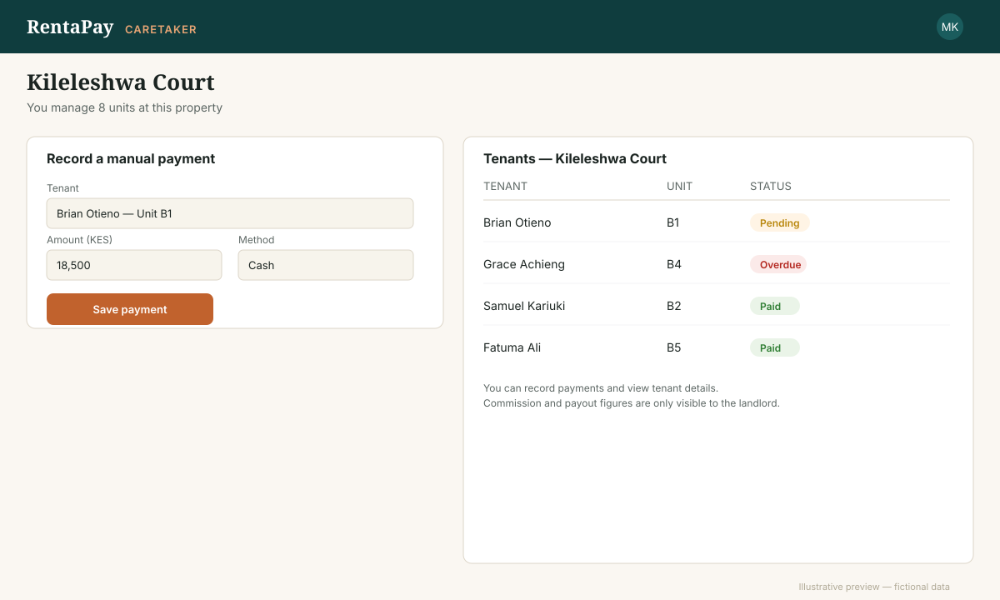

# The Property Manager / Caretaker portal

*Illustrative mockup, not a live screenshot — layout may differ slightly from the current app.*

Property managers and caretakers use RentaPay day to day to:

- **Record manual payments** — cash or bank deposits collected outside the
  app — so they show up in the landlord's records the same way a digital
  payment would.
- **View the tenant list** for the property or properties they've been
  given access to, including who's paid and who hasn't.
- **See unit-level detail** without needing to involve the landlord for
  routine day-to-day questions.

## What they can't see

A manager or caretaker only sees what the landlord has given them access
to. Commission, payout amounts, and other properties the landlord owns
outside their assignment stay visible to the landlord only — access is
scoped per property, not account-wide.
