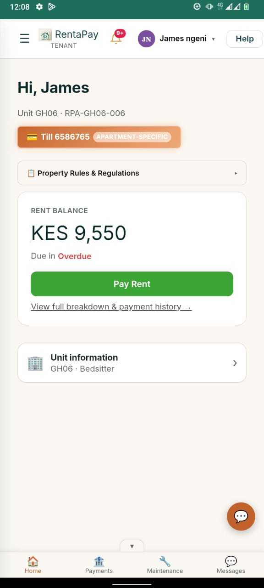
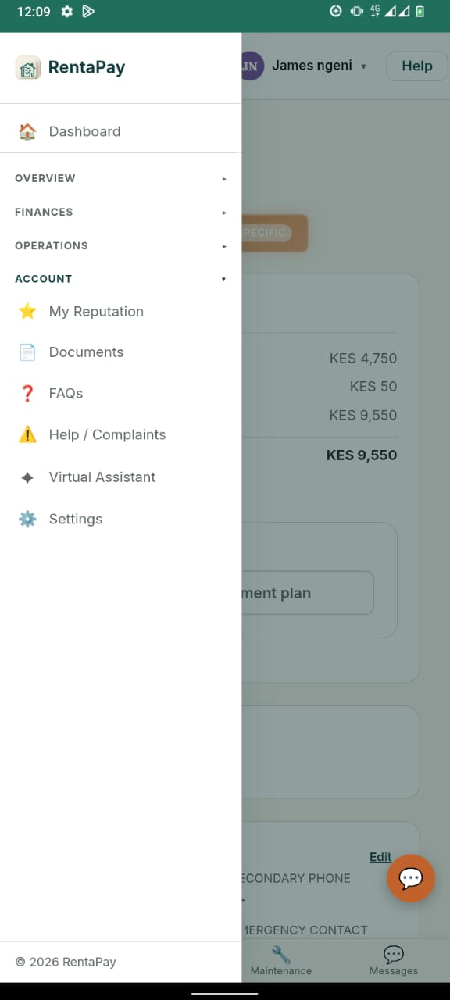

# The Tenant portal

*Real product screenshot. Tenant name and balance shown are illustrative.*

Tenants use RentaPay to:

- **See exactly what is due**, including whether it is upcoming or overdue, and the
  till or account number to pay to.
- **Pay and submit their payment code.** After paying to the number shown, the
  tenant enters the confirmation code in the app, which the landlord or their
  manager or caretaker then reviews and approves.
- **View their full payment breakdown and history**, and access a receipt once a
  payment is approved.
- **See their security deposit status**, once their landlord or manager has
  recorded it: the amount paid at move in, and, once a tenancy ends, whether it was
  refunded, partially refunded, or forfeited.
- **View a utility bill**, where the landlord has set up water or electricity
  submetering, showing usage and cost for their unit.
- **Raise a maintenance request or complaint**, and dispute a payment record they
  believe is wrong, all tracked in one place with the landlord's or manager's
  response visible alongside it.
- **Build a portable reputation.** A tenant's aggregate rating, based on payment
  reliability and care of the unit as scored by every landlord who has managed
  them, is tied to their own email address so it can, at their own choice, follow
  them to a new landlord on RentaPay, or be shared through a link they generate
  themselves.
- **Post to the community board**, where their landlord has enabled it, to reach
  other tenants at the same property.
- **Reach support**: call, WhatsApp, in app chat, or email, directly from the
  portal if something is not right. These contact details are kept current by the
  landlord's team, so tenants always have a working way to get help.

*Real product screenshot.*

Tenants also have access to their reputation history, documents shared with them,
FAQs, and a way to raise a complaint or reach the built in virtual assistant
directly from their own menu. The virtual assistant walks a tenant through the
portal the first time they log in, and stays available afterward through its own
floating button.

## The bottom navigation bar

On a phone, the tenant portal shows four quick links fixed to the bottom of the
screen at all times: Home, Payments, Maintenance, and Messages, so that whichever
screen you're on, switching to another core area is always one tap away rather than
needing to dig through a menu. This bar stays out of the way of whatever you're
scrolling through above it; if you ever see it covering the bottom of a list or a
button, that's worth reporting through Help, since it's not supposed to happen.

## What "Home" shows at a glance

The Home tab is built to answer the most common question a tenant opens the app to
ask, "where do I currently stand," without needing to tap into anything else: your
current balance, when it's due, and your most recent payment. Anything needing more
detail, such as a full payment history or a specific maintenance request's status, is
one tap further into the relevant tab.

## Messages and support

The Messages tab covers both messaging your landlord, manager, or caretaker directly
about something specific to your tenancy, and reaching RentaPay's own support team
for a platform issue. These are kept as separate, clearly labelled conversations
rather than mixed into one thread, so a question about a broken tap doesn't end up in
the same place as a question about how a feature works.

## Payments tab in detail

The Payments tab shows your full payment history for your unit, each entry showing
the amount, date, transaction code, and how it was confirmed. From here you can
also make a payment (where automatic M-Pesa collection is enabled for your unit) or
upload proof of a payment made outside the app for your landlord to confirm
manually. Every past receipt is available to view or download again at any time —
you never need to hunt down an old SMS confirmation once a payment is on record
here.

## Maintenance tab in detail

The Maintenance tab is where you report a new issue with your unit and track the
status of anything you've already reported. Each request shows its current status
and a timestamp for when it was last updated, so you can see at a glance whether
something you reported weeks ago has actually been picked up, rather than needing
to ask.

## Your balance, explained

Your current balance is always shown broken down into what it's made of — rent due,
any utility charges from submetering, and any other recorded charges — rather than
just a single total. This is deliberate: if a number ever looks wrong, you should
be able to check it against its parts immediately rather than having to ask what it
includes.
